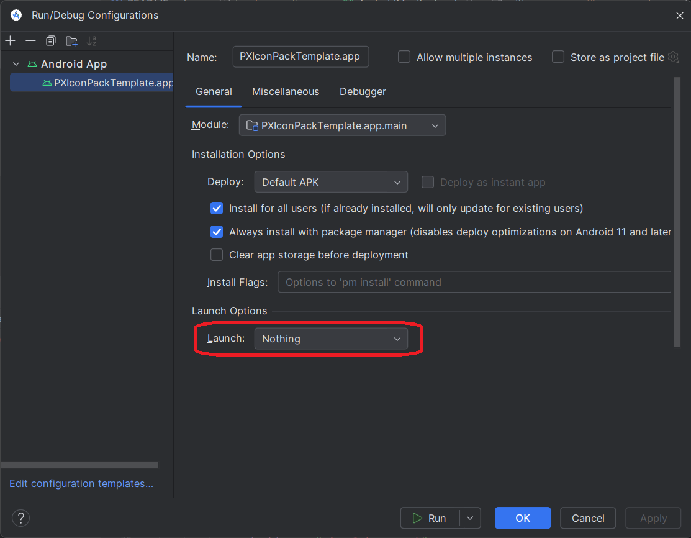

# Pixel Xpert Icon Pack Template

The official icon pack template from the team, for every prospective/current developer who wishes to create a new Icon Pack for Pixel Xpert!

To get started, first of all, FORK and CLONE this project on GitHub and open it up with Android Studio (We recommend to keep yourself up to date with the latest Google has to offer)

## Step 0: PRECONFIGURATIONS!

We assume that you know how to compile an APK, and have a basic understanding of Android Studio. If you don't, we recommend you to learn the basics of Android Studio and how to compile an APK before proceeding.

## Step 1: Package Naming
The FIRST thing you need to change is the package identifier (the name the app identifies as) to something more meaningful to you. Open up [build.gradle.kts](app/build.gradle.kts) and look for these lines
```kt
namespace = "sh.siava.iconpacktemplate"
applicationId = "sh.siava.iconpacktemplate"
```
Change this to anything you want, for instance:
```kt
namespace = "com.yourname.packname"
applicationId = "com.yourname.packname"
```

## Step 2: Start adding your packs
Open up [AndroidManifest.xml](app/src/main/AndroidManifest.xml) and look for the `<application>` tag.

Add the meta-data for author name
```xml
<meta-data
            android:name="packauthor"
            android:value="Siavash" />
```

Now add a new Activity: this will be your pack. (NOTE: you can have more than one pack in a single app)
```xml
<activity android:name="pack_name"
    android:label="Your Icon Pack"
    android:exported="true">
    <intent-filter>
        <action android:name="sh.siava.pixelxpert.iconpack" />
        <category android:name="android.intent.category.DEFAULT" />
    </intent-filter>
</activity>
```

In the `android:name` attribute, replace `pack_name` with the string attribute of your pack (only english and no spaces) This will be the reference of the icon pack in the next step.
In the `android:label` attribute, replace `Your Icon Pack` with the name of your pack (this can be any language and can have spaces)
Note: Optionally, you can pack multiple icon packs in one apk. To do so, you should make multiple copies of the `<activity>` block and give them different names

## Step 3: Start adding pack information!

Open up [arrays.xml](app/src/main/res/values/arrays.xml) and create a new string-array with the reference of your pack (the `pack_name` attribute from the previous step)
Something like:

```xml
<string-array name="pack_name">
    <item>mapping_drawables</item>
    <item>mapping_replacement</item>
</string-array>
```

Here, `mapping_drawables` and `mapping_replacement` are the references of the pack. You can have as many items as you want in the string-array, but make sure to have at least one item and both of them must have the same size.

First item, (in this example`mapping_drawables`) references the drawables name in the package you want to override (eg: `ic_alarm`), and second item (in this example `mapping_replacement`) references the drawables name in your pack (eg: `ic_alarm_filled`)

## Step 4: Adding your icons!

Start adding some drawables to your pack. You can add them in the [drawable](app/src/main/res/drawable) folder. Make sure to name them in the same order as the `mapping_drawables` and `mapping_replacement` in the previous step.

The icons you can modify in your icon pack are those in use by [Android Framework](https://cs.android.com/android/platform/superproject/main/+/main:frameworks/base/core/res/res/drawable/), [SystemUI](https://cs.android.com/android/platform/superproject/main/+/main:frameworks/base/packages/SystemUI/res/drawable/)(Note 1), [Settings](https://cs.android.com/android/platform/superproject/main/+/main:packages/apps/Settings/res/drawable/), [SettingsLib](https://cs.android.com/android/platform/superproject/main/+/main:frameworks/base/packages/SettingsLib/res/drawable/) (used in SystemUI & Settings apps), [Keyguard](https://cs.android.com/android/platform/superproject/main/+/main:frameworks/base/packages/SystemUI/res-keyguard/drawable/) and those injected by [PixelXpert](https://github.com/siavash79/PixelXpert/tree/canary/app/src/main/res/drawable) in SystemUI (like VoLTE icon) (Note 2).  
Note 1: When referring to framework icons, you MUST mention `android:` before the resource name (example: `<item>android:ic_wifi_signal_0</item>`)
Note 2: To replace the icons injected by PixelXpert into systemUI, add `module:` before the resource name (example: `<item>module:ic_volte</item>`)


## Step 5: Compile and test your pack!

Now you can compile your pack and test it on your device. If everything is working as expected, you can see the new pack in [Pixel Xpert](https://github.com/siavash79/PixelXpert)!

## Now what?

Nothing. Now you're set to publish your icon pack!

## Notes

### Deploy on mobile

Remember to select Launch Activity - Nothing in the run configuration before deploying the app on your device.



## Written with ❤ from Pixel Xpert team!
